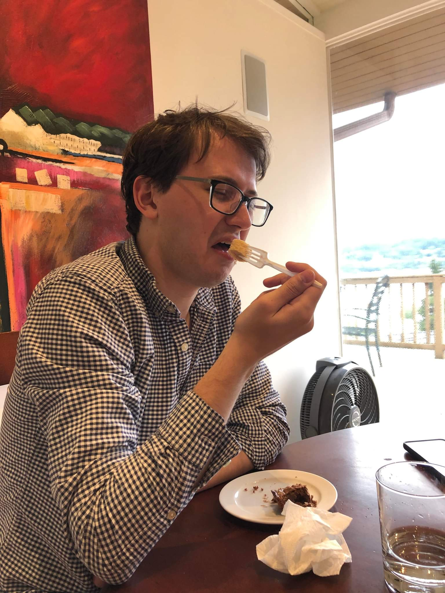
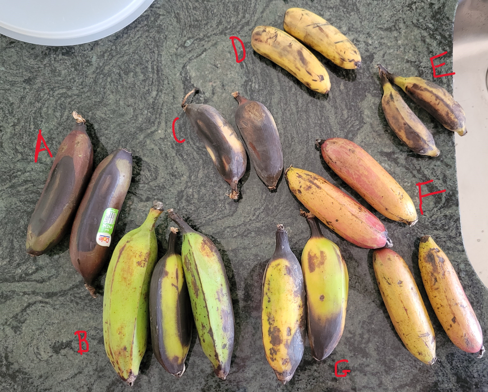
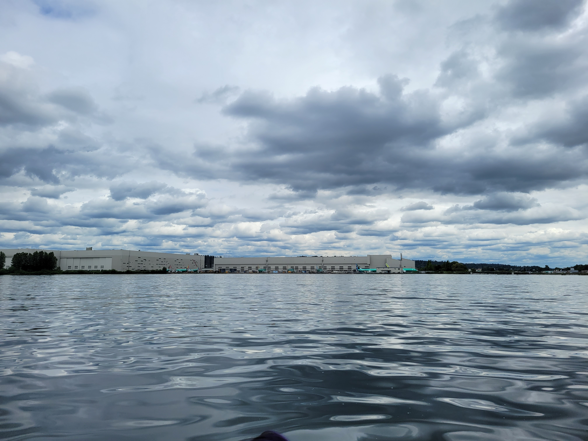
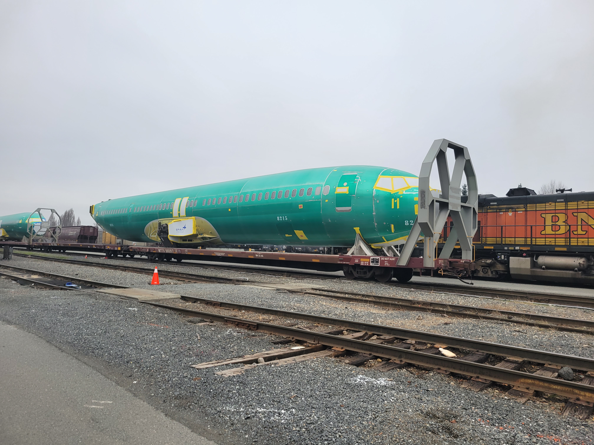

# Taste Testing

How much of how food tastes is psychological? Do different colored veggie straws, skittles, or M&M's really taste different? Years of development of experimental methodologies and advanced statistical techniques have given us the tools we need to answer these deeply important questions. Today, we endeavour to understand the differences within an extrememly common, highly processed, monocultural foodstuff: the banana.

## The Adams Fam Banana Ban
For as long as I can remember, I've hated bananas, just like my parents and my sister. The sweet, almost rotting smell; the stringy texture - all of it is repulsive to me. But when was the last time I really gave them a fair chance? Do I actually hate bananas, or was it a learned behavior from growing up in a family of 'nanner naysayers? Also, a wide variety of bananas exist - you may have heard of the Gros Michel, a cultivar of banana that was common until it became uneconomical to grow due to the prevalence of [Panama Disease](https://en.wikipedia.org/wiki/Panama_disease). Could it be that there is a type of banana out there that I could actually... like?

## Banana Rankings
We ordered bananas from an [online specialist shop](https://miamifruit.org/), as well as my local grocery store. It can be difficult to identify the banana exactly, so I've relied on [this page](https://www.growables.org/information/TropicalFruit/bananavarieties.htm) as well as Wikipedia to make guesses. Who knew there were so many kinds of bananas out there!

| Label | Name | Rating (/10 Cavendishes, lower is better) | Notes|
---     | ---      | ---   | ---  |
| A     | Red     | 15   | I don't think this banana was ripe when we tried it. It was completely inedible, drying your mouth very quickly and leaving a chalky/glue-like taste and feeling.  | 
| B     | Latundan     | 3  | Slightly acidic, apple or pear flavor. Very soft.  | 
| C     | Mysore     | 2   | Sweet and creamy, almost jolly-rancher-like flavor. I would be willing to eat the whole thing.  | 
| D     | Dole 'Baby Banana' | 8    | Tasted pretty much like a Cavendish, but smaller, which is a good thing.  | 
| E     | Unknown     |    |  | 
| F     | Thai     |     |  | 
| G     | Saba     | 6   | Very mild, more starchy like a plantain. Would be interesting to try roasting or frying it. | 
| N/A   | Cavendish     | 10   | Sickly-sweet smell, chemically taste, unpleasant texture.  | 

Overall, while it was a fun experience, I don't think I'll be picking up a banana-eating habit anytime soon. The types that I liked the most, Mysore and Latundan, are not readily availible near me. I prefer acidic fruits, and I'd rather spend my money on cherries and raspberries than unusual banana types. However, if I ever find myself in a region with lots of banana diversity, I'll definitely try some.
# Other fun stuff
On the same day as this banana tasting experiment, I got the chance to spend some time on my friend's boat in Lake Washington. The lake is a fantastic place for planespotting: there were floatplanes landing all day. At the southern end of the lake is [Renton Airport](https://skyvector.com/airport/RNT/Renton-Municipal-Airport), and you can see the 737s undergoing testing there from the water.

Another great place to see partially finished planes in Seattle is the trail past the rail yards in Interbay, where you can see 737 fuselages on their way from Witchita to Renton.

I'm still hoping to find the time to start flight training soon -- maybe next spring?