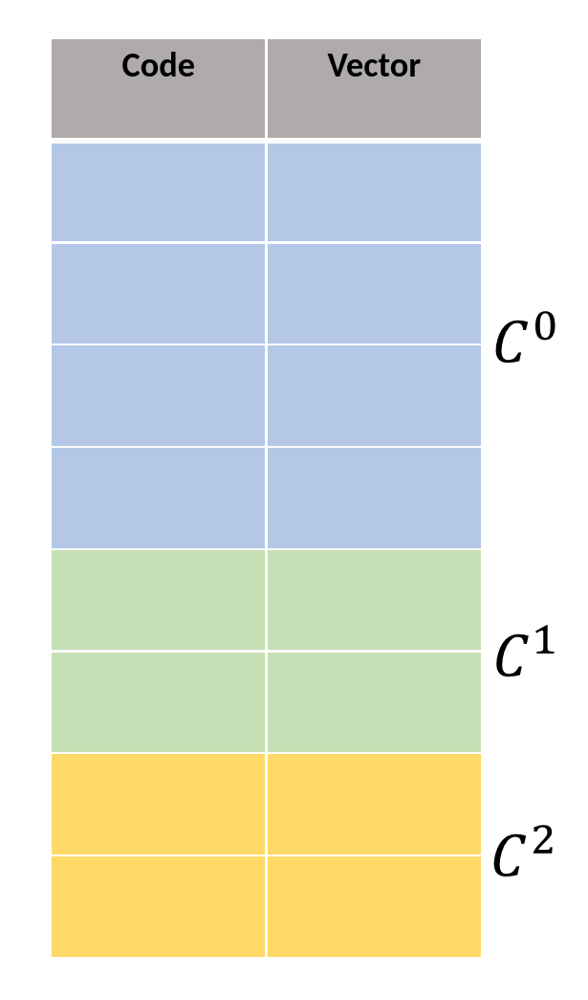
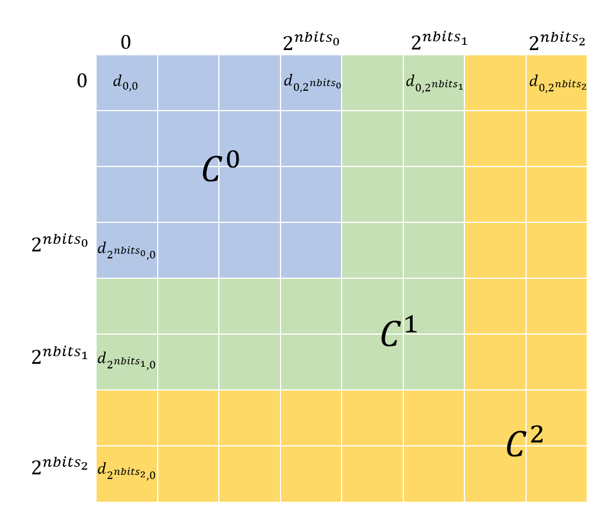
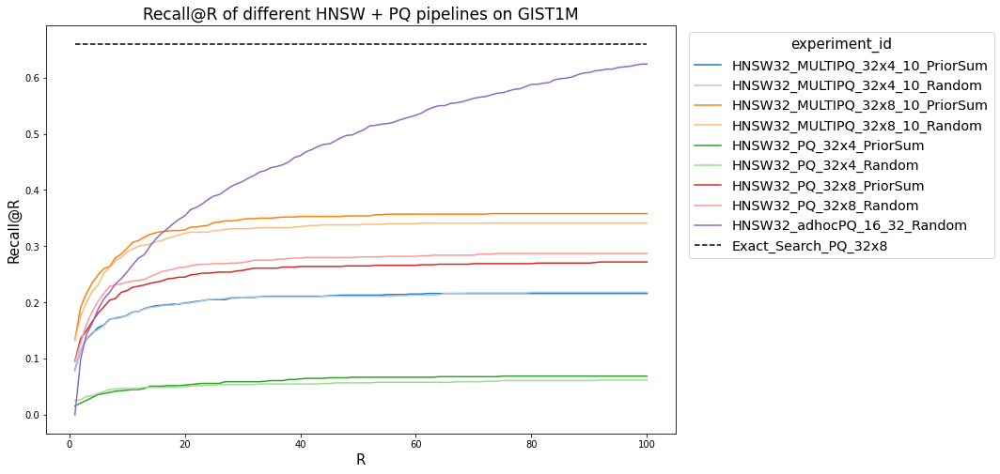
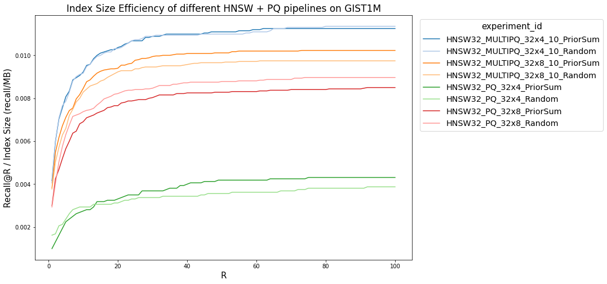
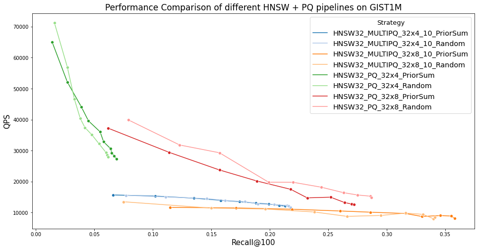

> **Note**: This approach is not performant in practice. 
      Please don't use this in a production system. I've written about it here because I think
      that it's a cool relaxation of PQ that clarifies some of the tradeoffs that make PQ good.

## Background

Approximate Nearest Neighbors (ANN) Search is a simple problem: given a vector query vector $q$, a set of database vectors $V$, and a metric $d$, find the $v\in V$ that minimize $d(q, v)$. The *approximate* part of this problem is that an algorithm is allowed to be wrong, and so in particular doesn't need to test every $v\in V$, allowing for significant improvements in performance through the use of various search structures and compression techniques.

An active research community has sprung up around building new techniques for this problem, driven by its importance to semantic search, where documents are embedded into a vector space to perform the search. [Facebook](https://github.com/facebookresearch/faiss), [Google](https://github.com/google-research/google-research/tree/master/scann), [Microsoft](https://github.com/microsoft/SPTAG), and [Yahoo](https://github.com/yahoojapan/NGT) have all released productionized systems for ANN search, based on work done by research teams at each organization. There is even a site providing head-to-head benchmarks of different systems on reference datasets, at [ann-benchmarks.com](http://ann-benchmarks.com).

One well-known compression technique is Product Quantization (PQ), first applied to ANN search in 2010 by Jegou et al[^pqcite]. PQ is parameterized by two variables, $M$ and $nbits$. It splits each vector $v$ of dimension $d$ into $M$ subvectors $v_1,\dots, v_M$ of dimension $\frac{d}{M}$. Then, it trains $M$ codebooks with $2^{nbits}$ entries each using K-means clustering on the sets of subvectors. Now, every vector can be represented as a code of length $M\cdot nbits$. An additional benefit of a coding scheme is that rather than performing expensive distance calculations between vectors, a lookup table with $M\cdot 2^{nbits} \cdot 2^{nbits}$ entries can be constructed, and distance calculations are reduced to $M$ lookups in this table. Query vectors can be handled similarly, either by encoding the query vector under the PQ scheme and using the existing table (called Symmetric Distance Calculation (SDC)), or by computing a query-specific distance table of size $M \cdot nbits$ (called Asymmetric Distance Calculation (ADC)). For large datasets, these distance table approaches are significantly faster than normal distance calculations between unquantized vectors.



There have been a number of research attempts to improve on the performance of PQ. An early observation was that the standard PQ approach is reliant on the basis the data is presented in. For an extreme example, suppose that we are quantizing four-dimensional vectors with $M=2, nbits=1$, and the vectors are:

$$ V = \\left\\{ [1,0,1,0], [0,1,0,1], [1,1,1,1], [0,0,0,0] \\right\\}$$

In this case, we have that the first and third dimension are perfectly correlated, and similarly with the second and fourth, and can observe that if we were able to swap the second and third dimensions we would be able to quantize the vectors losslessly. Optimized PQ (OPQ), first presented by Ge et al. in 2013,[^opqcite] gives us a way to do that. Before training the codebooks for each subvector, we first train an orthogonal matrix, which is applied to all the vectors before they are quantized. This allows us 'waste' fewer bits quantizing redundant information.

Another attempt to improve the recall-per-bit performance of PQ is Composite Quantization (CQ), presented by Zhang et al. in 2014[^cqcite]. In CQ, the training algorithm is given even more degrees of freedom to optimize with, as rather than splitting the vector into subvectors, it only requires that the subspaces spanned by the codebooks be mutually near-orthogonal, and reconstructs the resultant vector from codes through summation rather than concatenation of subvectors. This is a direct generalization of PQ to a larger configuration space, and the main contribution is the derivation of an efficient training method for the codebooks.

A final technique is Residual Quantization (RQ). This technique is applied after some initial quantization stage, either by means of a quantizer or a search structure like a K-means tree. The initial quantization stage trains a set of centroids and associates each vector with the nearest one, as usual. Then, the residual quantization stage involves quantizing the difference between the centroid and the actual datapoint. This second stage of quantization provides more accurate distance information between vectors, at the cost of space for a second set of codebooks and additional time encoding and decoding vectors. The process can be repeated multiple times, if desired, using the residuals from the previous stage at each step. It is used in Google's ScaNN vector search system[^scanncite].

One thing that all of these attempts to improve PQ have in common is that they all attempt to make improvements solely from the information contained in the data vectors themselves, rather than from information about the distribution of queries that will be made against that data. They mainly accomplish this goal by finding new ways to expand the optimization space the trainer can explore without significantly increasing the cost of training. Improvements that can be made purely by looking at the data are more desirable, since we can be more confident in their robustness to different applications and/or query distributions. Additionally, there is already a well understood literature and set of benchmarks for evaluating the performance of purely data-dependent ANN approaches. However, this focus on query-independent approaches may leave some low-hanging fruit for application that exhibit stable query distributions, such as web search.

In web search, the distribution of queries is known to be long-tailed. Because of this phenomenon, if we can expend extra resources on encoding/searching for vectors that are NNs for queries that occur frequently, we would expect to get an outsized return on those resources. Additionally, since those vectors make up a small portion of the dataset, the cost is not significantly higher than a conventional technique and so we do not expect degradation in tail performance.

### Definition of 'Prior' data and Hierarchical PQ
In the experiments discussed in this post, we consider two sets of queries, $Q_{\mathrm{train}}$ and $Q_{\mathrm{test}}$, drawn independently from the same distribution. We use the $Q_{\mathrm{train}}$ queries to compute the priors for each vector in the dataset. We define two types of prior, the linear and exponential falloff prior, as follows:

$$ \mathrm{NN}(q,v) = k : (v \text{ is a } k \text{-NN of } q \wedge \nexists k' < k : v \text{ is a } k' \text{-NN of } q)$$
$$ p_\mathrm{linear}(Q,v,k) = \frac{1}{|Q|} \cdot \sum_{q\in Q} (\mathrm{NN}(q,v) \leq k)$$
$$ p_\mathrm{expfalloff}(Q,v) = \frac{1}{|Q|} \cdot \sum_{q\in Q} e^{-\mathrm{NN}(q,v)}$$

Essentially, the more likely the vector is to come up as a result in the searches on $Q_{\mathrm{train}}$, the higher the prior. We then conduct the actual searches using $Q_{\mathrm{test}}$, which was drawn independently.

What is the best way to use this prior information? We had a number of ideas, including using the prior data during the construction of the search structure to make high-prior vectors more likely to be 'touched' by any given search, discussed further in the ['Other Experiments']() section. We opted for a more straightforward approach, though: using more bits to encode vectors that are high-prior than those that are low-prior (and thus encoding high-prior vectors more accurately). This is the main idea behind the technique explored in the rest of this post, which we call *Hierarchical PQ* (HPQ). In HPQ, rather than having one codebook per subvector, we have a hierarchy of codebooks $C^0 \subset C^1 \subset \dots \subset C^n$. We can decide which codebook to quantize any given vector with according to the prior information. Crucially, because the codebooks contain each other, they are *compatible*: we can use a distance table built on $C^n$, the codebook at the top of the hierarchy, to compute the distance between two vectors quantized by different levels on the hierarchy. This means that when handling queries, we only have to build the ADC distance table once per query. Because the distance table is so frequently accessed during search, this has the additional benefit of better cache performance from spatial locality versus an approach with multiple disjoint codebooks.

## Implementation Basics

We based our implementation on FAISS[^faisscite], a similarity search library from Facebook AI Research. FAISS has the advantages of good performance (including GPU support for common routines like PQ training), a convenient python interface for end-users generated with SWIG[^swigcite], and fairly good extensibility thanks to nice pluggable interfaces for different components of the index. 

Although it is theoretically possible to have an arbitrary number of levels of codebooks, it can become impractical to train many codebooks, and we expected to encounter diminishing returns to the number of tiers. So, we only implemented a two-level quantizer. Additionally, rather than modifying a K-means implementation to consider the 'fixed points' from the lower level codebooks, we just ran a separate training stage for the higher level codebook. 

## Performance Characteristics

There are two significant performance issues with the HPQ approach. By far the most important one is the increase in distance table size. In order to compute distances between quantized vectors efficiently, we build distance tables that store the distances between the vectors represented by each pair of codes. The distance calculation is then reduced to $M$ lookups in this table. When we introduce new codebooks in the hierarchy, we have to expand the distance tables to include these codes. However, for the performance of these distance tables to be good, they need to be resident in cache. Introducing the new codebooks will often make them too large to fit, significantly increasing distance computation. As an example, a Skylake processor has 32 KiB/core of L1 data cache, 1 MiB/core of L2 cache, and 1.375 MiB/core of L3 cache. If we store distance entries as float, and have 32 8-bit codebooks, that takes exactly $32\times 2^8 \times 4 \text{ bytes} = 32 \times 2^{10} \text{ bytes} = 32 \text{ KiB}$, perfectly fitting in L1 cache. Adding 2 bits of extra codebook space for high-prior vectors increases the distance table size to $128 \text{KiB}$, causing evictions into L2. This can significantly affect performance.

Another performance factor to consider is that of non-byte-aligned operations. Normally, PQ uses a codebook size of 256 vectors (8 bits) because it is small enough to train efficiently, allows easy indexing into codebooks with byte types, and gives decent performance. The next byte-aligned size, 16 bits (65,536 vectors), is usually too large to train centroids for. So, we have to make a choice between wasting memory by storing 10 or 12 bit quantizers in 16 bits, or performing extra shifts and masking operations to pack the entries into only the required number of bits. This causes significant performance degradation, which is amplified by the performance offered by byte-aligned SIMD instructions. 

## Results

We ran experiments on the GIST1M dataset. We assigned query priors according to a Zipf distribution. We then ran experiments comparing Recall@R for HNSW search, comparing normal PQ with HPQ. We ran these experiments with varying numbers of codebooks and codebook sizes, and also included a comparison of the 'Index Size Efficiency,' or recall per megabyte of memory used by the index. We also compared performance to a simple ad-hoc approach of building a separate, higher quality index to store high-query-prior vectors. 

The main positive result that we see is good size efficiency on the low end. Though MULTIPQ_32x4_10 (That's 32 codebooks, 4 bits per codebook for low-prior vectors and 10 bits for high-prior ones) takes up barely any more space in memory than PQ_32x4, it has significantly higher recall. This could prove useful in extremely memory-constrained scenarios. However, at a more typical 8 bits per codebook, the recall advantage, though still present, is smaller. We also see the performance penalty of larger codebooks and distance tables that don't fit as well in cache, with significantly reduced QPS for the MULTIPQ implementations. All the approaches perform much worse at high R than simply building two indexes, although that approach can cause resource challenges.

## Other Experiments {#other-experiments}

We tried two other techniques for 'prior-aware' search. The first was to modify the search structure in order to make high-query-prior vectors more likely to be considered during the search routine. We implemented this idea in a search structure called Hierarchical Navigable Small Worlds (HNSW), first presented by Malkov et al.[^hnswcite] in 2018. HNSW works by creating multiple layers, and selecting which layer each vector should have as it's highest layer by sampling from an exponential distribution. So, the top layer will have very few vectors, and the lowest layer contains the whole dataset. Within each layer, a neighborhood graph is constructed, allowing for search within the layer. A full search starts at the top layer, searches within it, then goes down into the next layer, searches within that layer, and so on until the bottom layer is reached. This technique achieves some of the best results on [ann-benchmarks.com](http://ann-benchmarks.com). We implemented a modification where instead of selecting a vector's layer by sampling from a random distribution, it selected based on the sample plus the prior. This did have the effect of pushing high-prior vectors to higher layers, meaning that they were seen by more searches. However, in our experiments, that structural change did not have any impact on performance. Investigating this further may be the topic of a future blog post!

Another technique we tried was based around 'learned termination'. Typical ANN search systems take some static parameter, usually called the 'search depth', that determines how extensive a search to perform (essentially, how many vectors to look at). Previous work by Ge et al. in 2020[^learned-termination-cite] used gradient boosting decision trees to predict midway through a search how helpful searching further would be, allowing early termination of the search when the model predicted that better results were unlikely to be found from searching further. This allows significant improvements in search throughput. We modified this system by including the query-priors of search candidates as features to the decision trees. If a search had no high-query-prior results, it might try searching a little bit further, to see if it can find one. Again, we didn't find any significant change in search performance or accuracy from this change.

## Code

The code used in these experiments can be found [here](https://github.com/PhilipBAdams/faiss-learned-termination-prior-weighted).

## Acknowledgments 
The majority of the work on this project was done as part of a course at UChicago, CMSC 33550, taught/advised by [Raul Castro Fernandez](https://raulcastrofernandez.com/). My partner for the project was my friend [Abdo](https://github.com/akabdo).

## Errata 
- The HPQ distance table figure contains off-by-one errors. Entries that read $2^{nbits_k}$ should read $2^{nbits_k} -1$. 

---
Note: the [featured image for this post](https://foto.wuestenigel.com/opening-matryoshka-dolls/) is by Marco Verch, and is licensed under [CC BY 2.0](https://creativecommons.org/licenses/by/2.0/).

[^pqcite]: Jegou, Herve, Matthijs Douze, and Cordelia Schmid. "Product quantization for nearest neighbor search." *IEEE transactions on pattern analysis and machine intelligence* 33, no. 1 (2010): 117-128.
[^opqcite]: Ge, Tiezheng, Kaiming He, Qifa Ke, and Jian Sun. "Optimized product quantization." *IEEE transactions on pattern analysis and machine intelligence* 36, no. 4 (2013): 744-755.
[^cqcite]: Zhang, Ting, Chao Du, and Jingdong Wang. "Composite quantization for approximate nearest neighbor search." In *International Conference on Machine Learning*, pp. 838-846. PMLR, 2014.
[^scanncite]: Guo, Ruiqi, Philip Sun, Erik Lindgren, Quan Geng, David Simcha, Felix Chern, and Sanjiv Kumar. "Accelerating large-scale inference with anisotropic vector quantization." In International Conference on Machine Learning, pp. 3887-3896. PMLR, 2020.
[^hnswcite]: Malkov, Yu A., and Dmitry A. Yashunin. "Efficient and robust approximate nearest neighbor search using hierarchical navigable small world graphs." *IEEE transactions on pattern analysis and machine intelligence* 42, no. 4 (2018): 824-836.
[^faisscite]: https://github.com/facebookresearch/faiss
[^swigcite]: http://www.swig.org/
[^learned-termination-cite]: Li, Conglong, Minjia Zhang, David G. Andersen, and Yuxiong He. "Improving approximate nearest neighbor search through learned adaptive early termination." In Proceedings of the 2020 ACM SIGMOD International Conference on Management of Data, pp. 2539-2554. 2020.
